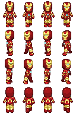

# Game-Development-Resources
### Here is a list of some websites where you can download some awesome game development resources. These include sprites, game tiles, sounds, fonts e.t.c.

| Link | Preview | About the website |
|------|-------|-------|
| [Kenney](https://kenney.nl/assets) |   | We've created over 40,000 images, audio files and 3D models for you to use in your projects. Thanks to our public domain license you're even allowed to use them in commercial projects! |
| [Untamed wild refuge](http://untamed.wild-refuge.net/rpgxp.php)| |Here you will find Sithjester's RPG Maker XP resources. Feel free to use my resources as you want, be it in free or commercial games, edited how you want, as bases for your own sprites, or for non-RPG Maker stuff (but don't ask me how to convert them to use in other programs XD) Just be sure to credit me! I'm afraid I'm not taking requests/commissions/otherwise assisting with your games, sorry! I get asked a lot what program I use for spriting. The answer to that is Paint Shop Pro. :)|
| [Game Art 2D](https://www.gameart2d.com/freebies.html) |  | (Game Art 2D is a one stop 2D game assets store to buy various royalty free 2D game art assets. It contains more than 100 game assets, from platformer & top down tileset, side scrolling & top down character sprite sheets, game GUI packs, space shooter assets, game backgrounds, and many more. You can also find a collection of free 2D game assets here. |
