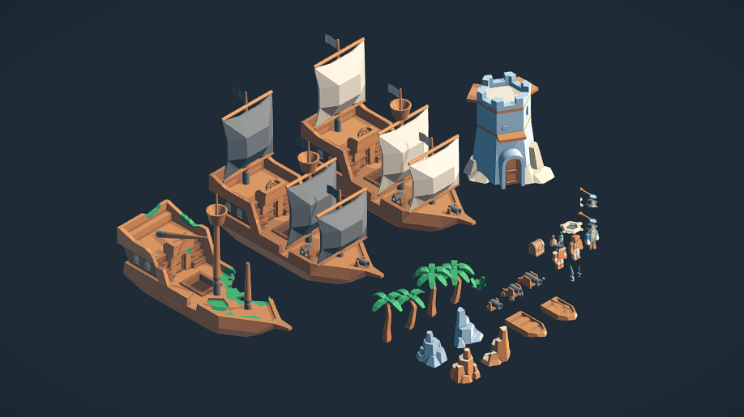

# Game-Development-Resources
### Here is a list of some websites where you can download some awesome game development resources. These include sprites, game tiles, sounds, fonts e.t.c.

| Link | About the website |
|------|-------|
| [Kenney](https://kenney.nl/assets)   | We've created over 40,000 images, audio files and 3D models for you to use in your projects. Thanks to our public domain license you're even allowed to use them in commercial projects! |
